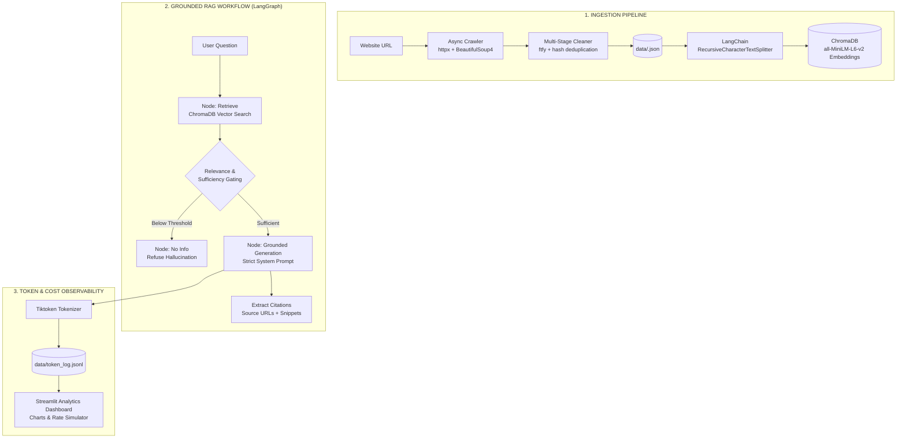

# Website-Grounded RAG Agent

> **An autonomous, production-grade AI Agent that crawls any website, cleans noise with multi-stage filtering, embeds without external API keys via ChromaDB, and performs strict, grounded question answering with LangGraph, verifiable citations, and real-time token observability.**

---

## Key Capabilities

1. **Autonomous Polite Crawler**
   - Breadth-first asynchronous crawl with rate limiting (`asyncio` + `httpx` + `BeautifulSoup4`).
   - Domain boundary lockdown (crawls only internal links).
   - Strict `robots.txt` politeness compliance and binary file filtering (images, PDFs, ZIPs excluded).
   - URL normalization and hash-based deduplication.

2. **High-Fidelity Text Cleaner (Anti-Noise Pipeline)**
   - **Structural Noise Stripping**: Removes `<nav>`, `<header>`, `<footer>`, `<script>`, `<style>`, `<form>`, `<aside>`, and ads.
   - **Unicode & Encoding Repair**: Uses `ftfy` to normalize broken mojibake, curly quotes, and non-breaking spaces.
   - **Cross-Page Boilerplate Removal**: MD5 hash-frequency analysis discovers and strips repeating navigation bars, copyright strings, and cookie notices.
   - **Quality Scoring**: Discards empty or low-content pages before indexing.

3. **Zero-API-Key Vector Database**
   - **ChromaDB** with built-in default embedding function (`all-MiniLM-L6-v2`).
   - Runs locally on CPU/GPU without requiring an OpenAI or HuggingFace API key for vectorization.
   - Multi-tenant architecture: each website gets an isolated, sanitized collection.
   - Deterministic chunk IDs ensure idempotency and prevent duplicate embeddings.

4. **LangGraph Grounded RAG Agent**
   - Cyclical 3-node state graph: `retrieve` ➔ `check_sufficiency` ➔ `generate` / `no_info`.
   - **Relevance Gating**: Chunks below a configurable cosine relevance score threshold are discarded.
   - **Anti-Hallucination Guardrails**: If context is insufficient, routes directly to a grounded fallback refusing to speculate.
   - **Verifiable Citations**: Returns exact source URLs, section labels, and chunk excerpts for every answer.
   - **Streaming SSE**: Full Server-Sent Events support for real-time word-by-word streaming in the UI.

5. **Token Analytics & Cost Observability**
   - Exact token counting via `tiktoken` (`gpt-4o` / `cl100k_base`).
   - Real-time cost calculation based on prompt and completion pricing.
   - Persistent audit logging in `data/token_log.jsonl`.
   - Dedicated interactive Streamlit dashboard with Plotly charts and cost simulator.

---

## Architecture Overview



---

## Project Structure

```
Website_Rag_Assistant/
├── backend/
│   ├── main.py                  # FastAPI application entrypoint & middleware
│   ├── config.py                # Environment configuration & directory anchors
│   ├── models/
│   │   └── schemas.py           # Pydantic request & response models
│   ├── routers/
│   │   ├── crawl.py             # POST /crawl, GET /crawl/status/{task_id}
│   │   ├── ingest.py            # POST /ingest, DELETE /ingest/{company}
│   │   ├── rag.py               # POST /rag (JSON & Streaming SSE)
│   │   └── manage.py            # GET /websites, /websites/json-files, /stats
│   └── services/
│       ├── crawler.py           # Async crawler with robots.txt & domain filter
│       ├── cleaner.py           # Multi-stage HTML, boilerplate & encoding cleaner
│       ├── chunker.py           # LangChain recursive character splitter
│       ├── vector_store.py      # ChromaDB singleton & all-MiniLM-L6-v2 embeddings
│       └── rag_pipeline.py      # LangGraph state machine & tiktoken cost logger
├── frontend/
│   ├── app.py                   # Streamlit Home & Control Center Dashboard
│   ├── utils.py                 # Shared CSS, theme tokens, and API client
│   └── pages/
│       ├── 1_Data_Ingestion.py  # 3-Tab Crawl, Ingest, and Knowledge Base Manager
│       ├── 2_RAG_Assistant.py   # Grounded Chat with Citations & Streaming
│       └── 3_Token_Analytics.py # Interactive Observability Dashboard
├── data/
│   ├── posidex.json             # Pre-cleaned 118-page dataset for Posidex
│   └── token_log.jsonl          # Continuous audit log of token usage & latency
├── chroma_db/                   # Persistent ChromaDB vector collections
├── evaluation/
│   ├── eval_set.md              # 15-question benchmark (factual, synthesis, negative)
│   └── run_eval.py              # Automated CLI benchmark runner
├── pyproject.toml               # Python dependencies & metadata
└── .env.example                 # Environment configuration template
```

---

## Quickstart Guide

### 1. Prerequisites & Environment Setup

Ensure Python 3.11+ is installed. Clone the repository and install dependencies using `uv` or `pip`:

```bash
# Using uv (recommended)
uv sync

# Or using standard virtualenv
python -m venv .venv
.venv\Scripts\activate
pip install -r pyproject.toml
```

### 2. Configure Environment Variables

Copy the template `.env.example` to `.env`:

```bash
cp .env.example .env
```

Set your OpenAI or compatible LLM API Key:
```env
LLM_API_KEY=your-openai-or-openrouter-key
LLM_MODEL_NAME=gpt-4o-mini
LLM_BASE_URL=https://api.openai.com/v1
```
*(Note: No embedding API key is needed! ChromaDB uses local embeddings out of the box).*

### 3. Launch Backend & Frontend

Open two terminal windows:

**Terminal 1 — FastAPI Backend (Port 8009):**
```bash
.venv\Scripts\uvicorn backend.main:app --port 8009 --reload
```
- Swagger API Docs: `http://localhost:8009/docs`
- Health Check: `http://localhost:8009/health`

**Terminal 2 — Streamlit Frontend (Port 8501):**
```bash
.venv\Scripts\streamlit run frontend/app.py
```
- Open your browser at `http://localhost:8501`

---

## User Walkthrough

### 1. Ingesting Data (Instant or Crawl)
1. Go to **Data Ingestion** in the sidebar.
2. **Instant Ingestion**: A pre-crawled 118-page dataset for **Posidex** (`data/posidex.json`) is included. Select the "Ingest to Vector DB" tab and click **Ingest into Vector Store**.
3. **New Crawl**: Under the "Crawl Website" tab, enter any public URL (e.g. `https://example.com/`), name the company, and click **Start Async Crawl**. The system will crawl internal pages, clean noise, and save a structured JSON.

### 2. Asking Questions (Grounded RAG)
1. Go to **RAG Assistant**.
2. Select the ingested website from the dropdown.
3. Ask factual questions (e.g. *"What is PrimeMDM?"* or *"What is PII Data Vault?"*).
4. Inspect the answer, expandable **Source Citations** with live URLs, and token usage metadata.
5. Test anti-hallucination by asking out-of-scope questions (e.g. *"Who won the UEFA Championship?"*); the agent will politely decline to answer.

### 3. Observability & Token Analytics
1. Go to **Token Analytics**.
2. View total prompts, completions, and estimated spending.
3. Explore the interactive latency and token usage charts over time.
4. Use the cost recalculator to estimate expenses under different LLM pricing tiers.

---

## Running the Evaluation Benchmark

Run the 15-question benchmark to verify factual accuracy and anti-hallucination guardrails:

```bash
.venv\Scripts\python.exe evaluation/run_eval.py --company posidex
```

The benchmark tests:
- **5 Factual Queries**: Direct retrieval of product names, leadership, and metrics.
- **5 Cross-Page Synthesis Queries**: Multi-page consolidation across industries and history.
- **5 Negative / Out-of-Scope Queries**: Asserts that no hallucinations occur for missing information.

---

## Anti-Hallucination Guarantees

1. **Relevance Thresholding**: Embeddings below `RAG_MIN_RELEVANCE_SCORE` (0.30) are eliminated.
2. **Sufficiency Node**: If no documents pass the threshold, LangGraph skips generation and returns an explicit *"I do not have enough information"* message.
3. **Strict System Prompt**: The LLM is prohibited from incorporating external pre-training knowledge.
4. **Traceable Citations**: Every answer requires valid document sources.
